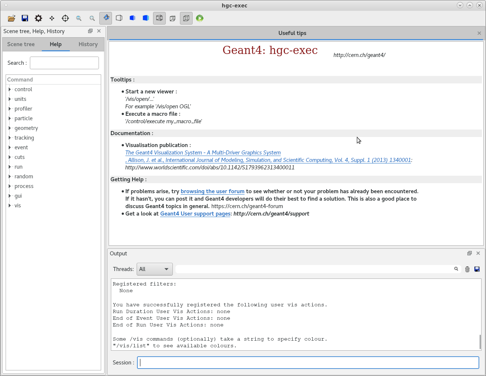
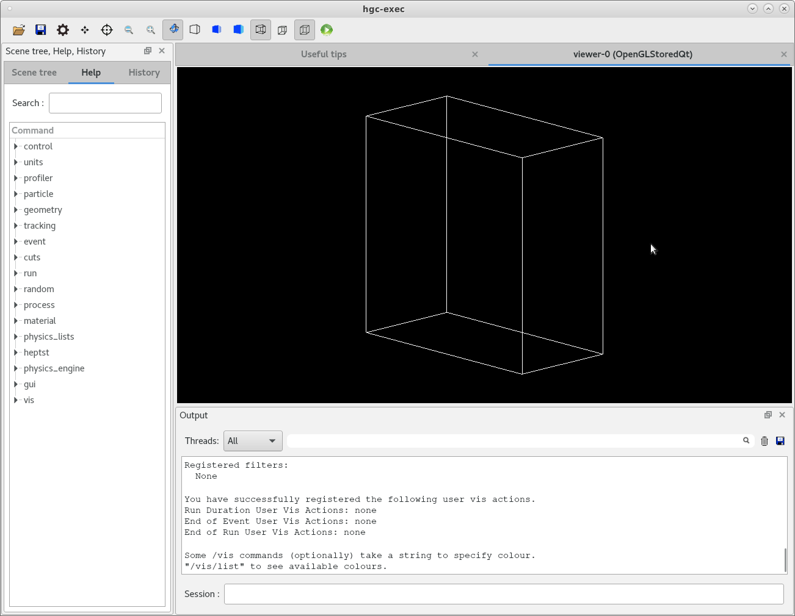
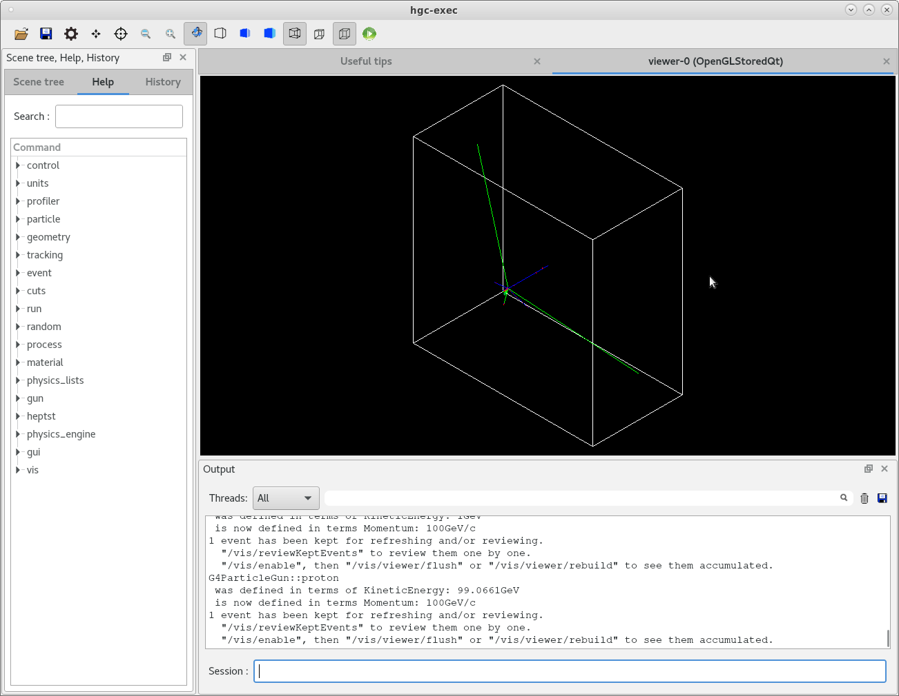
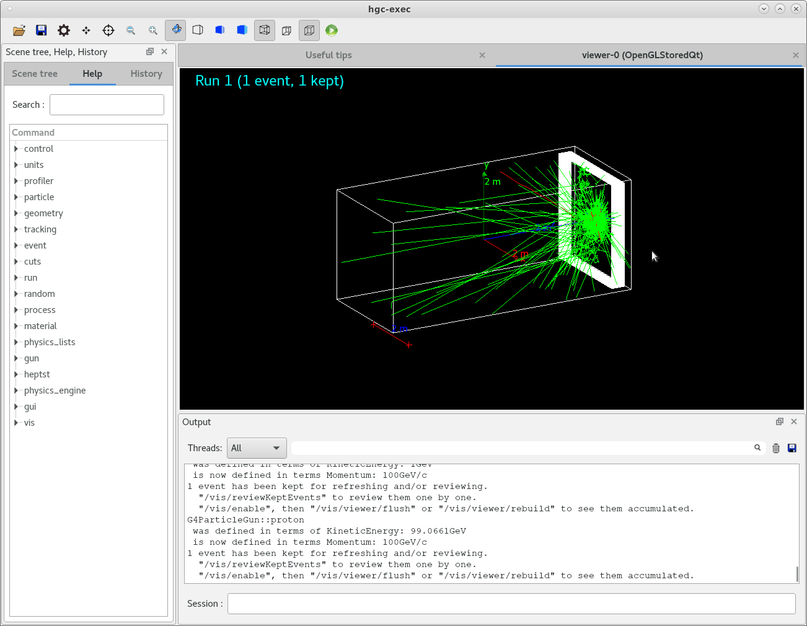
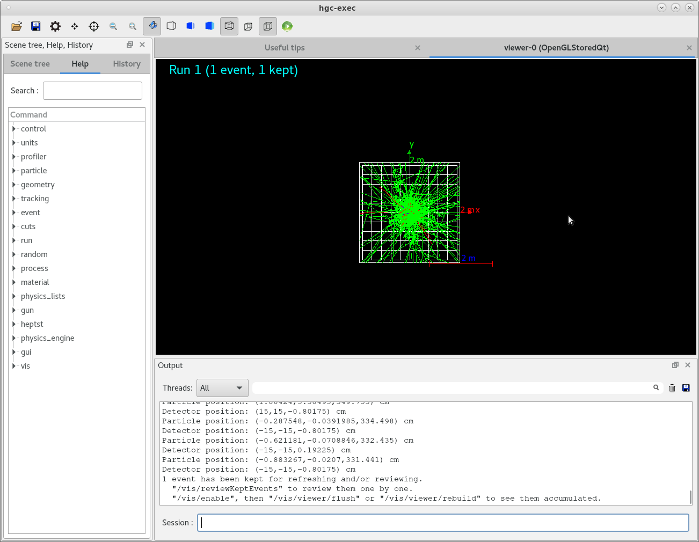
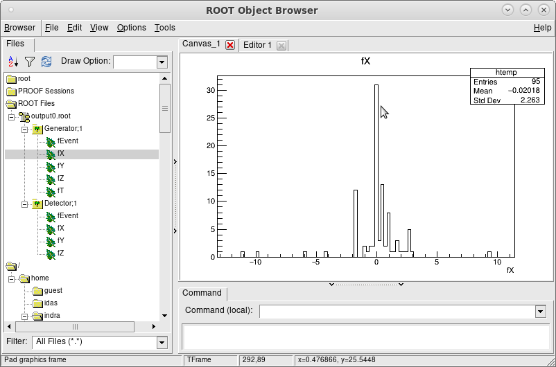
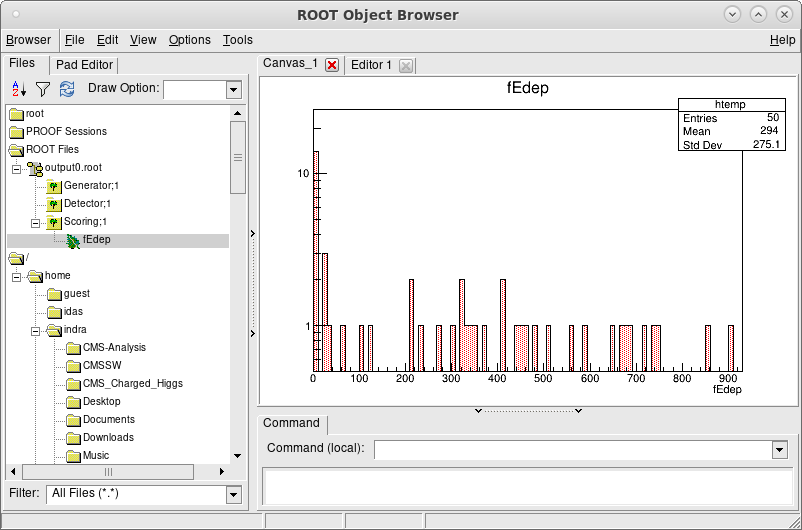
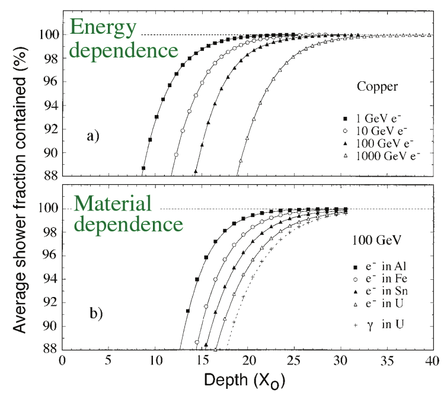

# geant4-hgcal-tutorial

It is recommended that you create a separate folder for each of the following problems. The folder should contain only the necessary files and codes relevant for the problem. The spirit of this tutorial set is to write the required codes by yourself instead of cut-paste from example, so that one gets familiar with the required classes and the step-by-step development of a GEANT4 framework.

---
## Problem 1

Create a GEANT4 project with a cmake file and C++ main GEANT4 code to open the GEANT4 GUI.  
a) You learn the main access and interaction with GEANT4

(Note : If you are unaware of the cmake file copy it from GEANT4 example "examples/basic/B1/CMakeLists.txt" and modify for your project. However, it is expected that you write the basic GEANT4 main code by yourself)

The expected set of files are:  
CMakeLists.txt  
hgc-exec.cc

Once run properly it will produce a picture like below.

    

---
## Problem 2

Write a separate class to construct a box shaped world filled with G4_AIR.   
a) You learn how to access the class members of "G4VUserDetectorConstruction"

The expected set of files are:  
CMakeLists.txt  
hgcaldetector.cc  
hgcaldetector.hh  
hgc-exec.cc 

It is expected to produce a output like below.

    

---
## Problem 3

Setup a particle gun to shoot 100 GeV proton beam deriving from class G4VUserPrimaryGeneratorAction and connect to main program via action initialization. The action initialization is derived from class G4VUserActionInitialization.  
a) You learn to setup a particle generator
b) All action initialization will be managed via your private action initialization class (like actioninit.cc and .hh files below). This will be helpful at a later point.

The expected set of files are:  
actioninit.cc  
actioninit.hh  
CMakeLists.txt  
hgcaldetector.cc  
hgcaldetector.hh  
hgc-exec.cc  
particlegun.cc  
particlegun.hh

After successful implementation you should see the proton track as in the image below.

    

---

## Problem 4

Now modify the detector construction file (hgcaldetector.cc) to place the detector components. 

There will be 26 cassettes of dimension 302 cm x 302 cm x 3.0345 cm, each will contain consecutive layers of
1) one 300 cm x 300 cm layer of Si (density : 2.33 g/cm3) with 0.3 mm of thickness
2) one 300 cm x 300 cm layer of CuW (density : 14.979 g/cm3, W:Cu = 75%:25%) with 1.4 mm thickness
3) one 300 cm x 300 cm layer of Cu (density : 8.96 g/cm3) with 6.05 mm thickness
4) Another layer of CuW of same dimension as above
5) Another layer of Si of same dimension as above
6) one 300 cm x 300 cm layer of Pb (density : 4.97 mm) with 6.05 mm thickness

The list of files are same as above.
If you now shoot a particle it will create like the image below.

    

---
## Problem 5

Now segment both Si sensor layers each of size 300 cm x 300 cm  into 10x10 arrays of smaller sensors so that Si layer has dimension 30 cm x 30 cm x 0.3 mm. Add a class to access the each stepping process of the sensitive detector (Si in present case). Print the particle position as obtained from the particle hit and as obtained from the segmented detector.

a) You learn how to access the detector information of each step by deriving methods from G4VSensitiveDetector class.

The list of files are,  
actioninit.cc  
actioninit.hh  
CMakeLists.txt  
hgcaldetector.cc  
hgcaldetector.hh  
hgc-exec.cc  
particlegun.cc  
particlegun.hh  
sensitivedetector.cc  
sensitivedetector.hh

Check that you do not have any volume overlap issue.
On successful operation you would find a picture like below.

    

---
## Problem 6

Store the X,Y,Z,T of particle hit position and the X,Y,Z as obtained from detector in two different ntuples of root file. Also store the event numbers in those two branches.
a) You learn how to store information in a ROOT file by deriving methods from G4UserRunAction class.

The list of files are,  
actioninit.cc  
actioninit.hh  
CMakeLists.txt  
hgcaldetector.cc  
hgcaldetector.hh  
hgc-exec.cc  
particlegun.cc  
particlegun.hh  
runaction.cc  
runaction.hh  
sensitivedetector.cc  
sensitivedetector.hh

The ROOT file will have the following information.

    

---
## Problem 7
Create a separate branch to store the energy loss information in the detector. 
a) You learn the basic of scoring method by adding classes to be called after each event (G4UserEventAction) and each stepping (G4UserSteppingAction). 

The list of expected files are,  
actioninit.cc  
CMakeLists.txt  
eventaction.hh    
hgcaldetector.hh  
particlegun.cc  
runaction.cc  
sensitivedetector.cc  
steppingaction.cc 
actioninit.hh  
eventaction.cc  
hgcaldetector.cc  
hgc-exec.cc       
particlegun.hh  
runaction.hh  
sensitivedetector.hh  
steppingaction.hh

One can see the energy loss information as separate branch.

    

---
## Problem 8

Modify the detector configuration on fly using G4GenericMessenger feature. For instance, the Si sensors can be divided into 40x40 or 100x100 arrays, to investigate the effect of detector segmentation on various physics studies. 

The list of files are same as before.

---
## Problem 9

Implement the changes to your code to run GEANT4 in multithreading mode to simulate   
a) pi+ and pi- of 20 GeV  
b) e+ and e- of 200 GeV  
c) mu+ and mu- of 100 GeV

in a single command.

The list of files are same as before.

---
## Problem 10

The motivation of EM calorimeter is to fully contain the shower originated from high energy (up-to 1 TeV) electron or gamma. Plot the fraction of shower containment as a function of radiation length as in the upper plot of the picture below.

    

The list of files are same as before.

---

#### Acknowledgment

Much of the tutorials is prepared using the GEANT4 examples and "Physics Matters" YouTube channel by Mustafa Schmidt.
