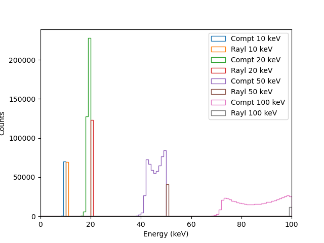
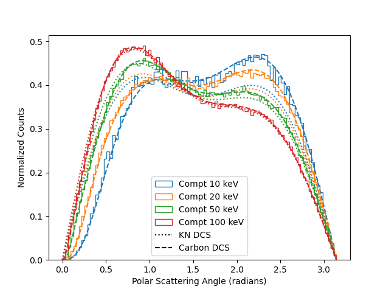
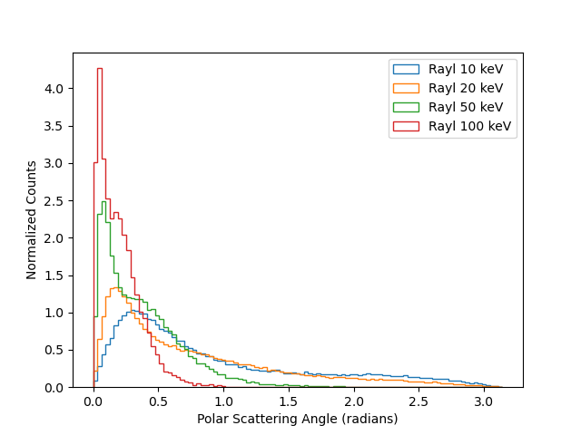
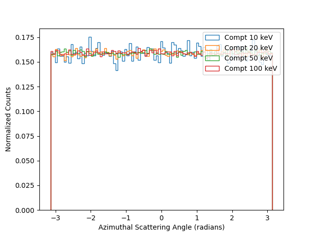
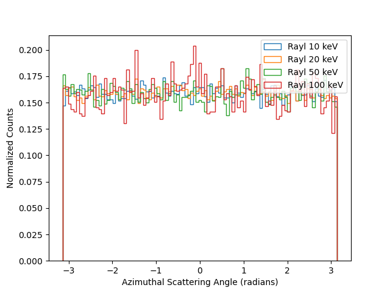
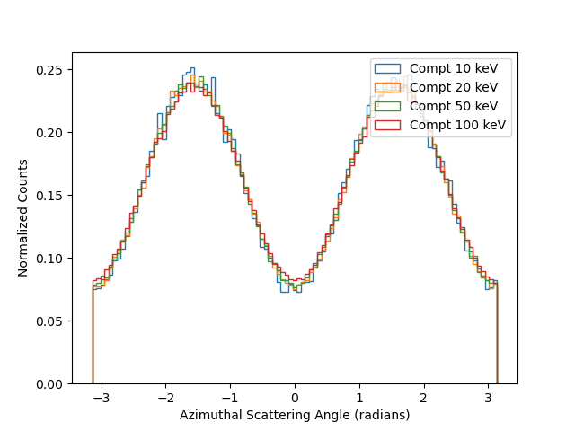
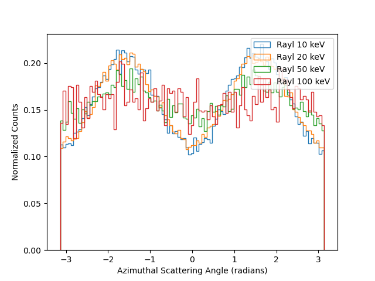

Compton/Rayleigh scattering and X-ray polarimetry
--------------------------------------------------

Polarization measurements of astrophysical sources in X-ray energies is an
area with lot of excitement in recent days with the IXPE mission and
upcoming Indian mission XPoSat. Measurement of polarization in X-ray
energies above ~10 keV makes use of the unique characteristics of Rayleigh
and Compton scattering of the incident photons in detector systems. In
this exercise, we will start with simple Geant4 simulations to understand
basic properties of Rayleigh/Compton scattering and how they are dependent
on the polarization of incident beam and finally try simulations of some
simple X-ray polarimeter configurations in different steps.

1) In Geant4, setup a simulation as follows:

  - A plastic scintillator rod (1 mm diameter, 50 mm long) as the active
detector volume.
  - Low energy Livermore polarized EM physics
  - General particle source with parallel beam of mono energetic X-rays
incident on the scintillator.
  - If the interaction process in plastic scintillator is Rayleigh or
Compton scattering, record the energy of the scattered photon as well as
the direction (Hint: Post step point momentum).
  - For each primary event, write out the above detail into a text file

  (**a**) Carry out simulations with 10 keV, 20 keV, 50 keV, and 100 keV photons
and using the outputs from Geant4, plot the spectra of scattered photons
(energy vs counts), histogram of scattering angle theta, and histogram
of azimuthal angle phi as shown in the examples below. Try overplotting 
Klein–Nishina differential cross section of Compton scattering by free electrons 
with the distribution of polar angles obtained from Geant4 simulations.

<table>
  <tr>
<td></td>
<td></td>
</tr>

  <tr>
<td></td>
<td></td>
</tr>
</table>

  (**b**) Repeat the above exercise with the same setup, but with the incident
photons polarized in specific direction. Plot the different distributions as above. Note the 
difference in azimuthal scattering angle distributions as shown in figures below compared 
to that of unpolarized photons. See how the distribution varies with different polarization 
directions.

<table>
  <tr>
<td></td>
<td></td>
</tr>
</table>

(**c**) Have a look at how the azimuthal angle distribution for polarized photons vary when 
only photons of a selected range of theta values are considered, for example only between 60 
to 120 degree. See how it compares with the azimuthal angle distribution for entire range 
of theta values.

2) From the above two steps, we understand that the azimuthal scattering
angle distribution is dependent on the polarization characteristics of the
incident beam. So, if we manage to measure the the azimuthal angle
distribution of the scattered photons, we can measure the polarization of
the incident beam, which is how scattering X-ray polarimeters work.

So, let us do simulations of a simple ideal polarimeter as shown below. At
the center is a plastic scintillator as we used in earlier steps and it is
surrounded by a cylindrical detector.

(Picture of ideal polarimeter)

- Setup the above polarimeter geometry in Geant4 with the surrounding
detector as CsI. Dimensions marked in the figure above.

- Carry out simulations with mono energetic parallel beam incident on the
plastic scintillator rod.

- For events that are detected in the surrounding detector, record the
azimuthal angle of the photon in plane perpendicular to the incident beam
with respects to some reference axis. Record events for which there was
some energy deposition in the plastic scintillator separately.

- Generate histogram of azimuthal angles for all events detected in the
surrounding detector as well as those having only coincident detection (ie, non-zero energy depositions above 
some threshold, say 1 keV in the scattering plastic scintillator)

Plot them for unpolarized incident beam as well as polarized incident beam
with different polarization angles.

(Show some representative result plots here).
