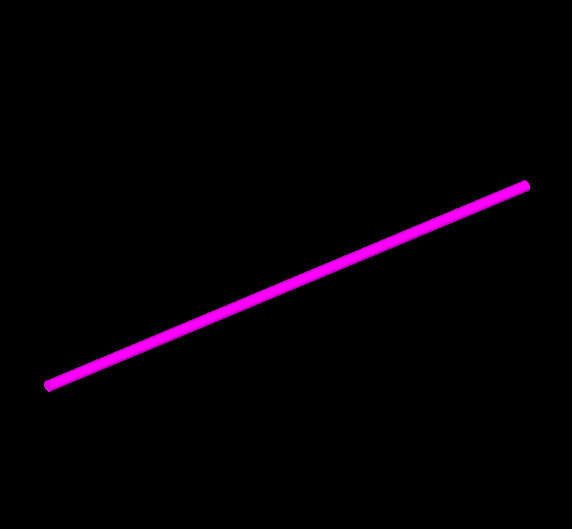
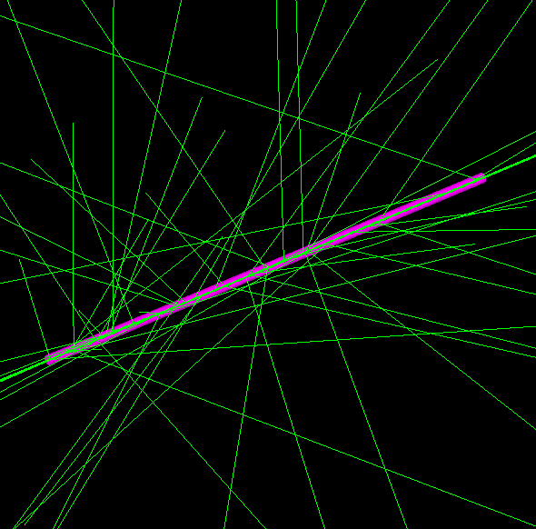
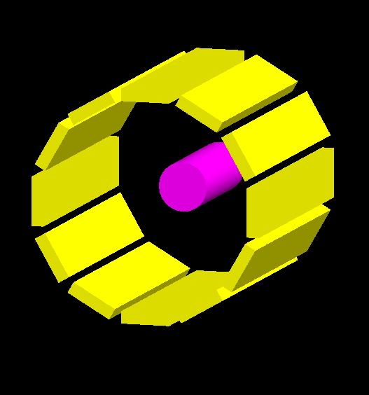
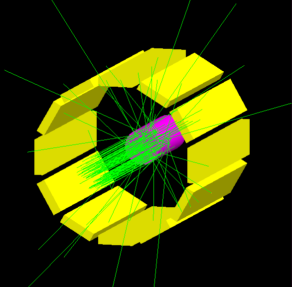
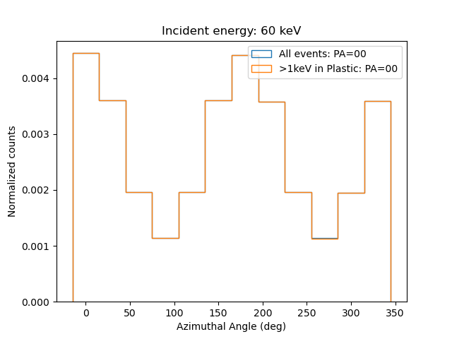
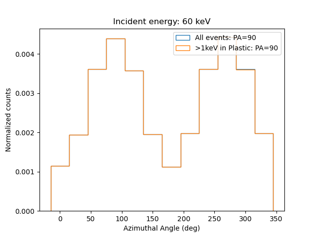
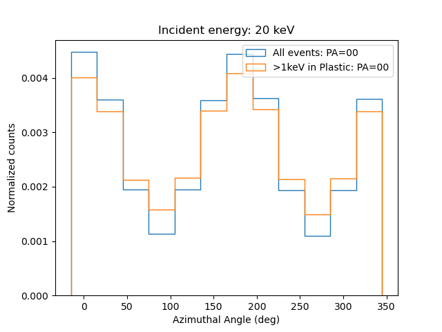

Compton/Rayleigh scattering and X-ray polarimetry
--------------------------------------------------

Polarization measurements of astrophysical sources in X-ray energies is an
area with lot of excitement in recent days with the IXPE mission and
upcoming Indian mission XPoSat. Measurement of polarization in X-ray
energies above ~10 keV makes use of the unique characteristics of Rayleigh
and Compton scattering of the incident photons in detector systems. In
this exercise, we will carry out simple Geant4 simulations to understand
basic properties of Rayleigh/Compton scattering and how they are dependent
on the polarization of incident beam and then do simulations of a
simple X-ray polarimeter.

### Problem 1: Scattering angle distributions

(**a**) Setup a Geant4 simulation as follows:

  - Detector Construction: A plastic scintillator rod (1 mm diameter, 50 mm long) placed in 
  the world volume. Plastic material is VinylToluene with mass fraction of Carbon 
  and Hydrogen 0.915 and 0.085,respectively. Density is 1.032*g/cm3.  
  - Physics list: Modular physics list - G4EmLivermorePolarizedPhysics
  - Make a working Geant4 application and visualize. On visualizing, the detector should be visible similar to the below image.

  
(**b**) Now, setup primary particles for simulation using General Particle Source (GPS). Place a source emitting mono-energetic parallel gammas in front of the scintillator. Run the simulation with this source with tracking verbose set to 1. You should see gammas interacting with scintillator as shown in the below image. Look at the verbose output and see the different processes that the primary gammas undergo in the detector.   
  

  
(**c**) By accessing the step point information using user stepping action, identify events undergoing rayleigh and compton scattering in the detector and record the scattered photon energy as well as the direction (Hint: Post-step point momentum). Note that we want to get only the first interaction of the primary gamma. For each primary event with scattering interaction, write out whether it was rayleigh or compton as well as the scattered photon energy and direction. Save the results in output text/root file.

(**d**) Carry out simulations with 10 keV, 20 keV, 50 keV, and 100 keV photons
and using the outputs from Geant4, plot the spectra of scattered photons
(energy vs counts), histogram of scattering angle theta, and histogram
of azimuthal angle phi as shown in the examples below. Try overplotting 
Klein–Nishina differential cross section of Compton scattering by free electrons 
with the distribution of polar angles obtained from Geant4 simulations.

<table>
  <tr>
<td></td>
<td></td>
</tr>

  <tr>
<td></td>
<td></td>
</tr>
</table>

(**e**) Repeat the above exercise with the same setup, but with the incident
photons polarized in specific direction. Plot the different distributions as above. Note the 
difference in azimuthal scattering angle distributions as shown in figures below compared 
to that of unpolarized photons. See how the distribution varies with different polarization 
directions.

<table>
  <tr>
<td></td>
<td></td>
</tr>
</table>

(**f**) Additional excercise: Have a look at how the azimuthal angle distribution for polarized photons vary when 
only photons of a selected range of theta values are considered, for example only between 60 
to 120 degree. See how it compares with the azimuthal angle distribution for entire range 
of theta values.

### Problem 2: X-ray polarimeter simualtions

From the above excercise, we understand that the azimuthal scattering
angle distribution is dependent on the polarization characteristics of the
incident beam. So, if we manage to measure the the azimuthal angle
distribution of the scattered photons, we can measure the polarization of
the incident beam, which is how scattering X-ray polarimeters work.

So, let us do simulations of a simple ideal polarimeter as shown in the image below. At
the center is a plastic scintillator as we used in earlier step, but with diameter of 20 mm and it is
surrounded by 12 CsI(Tl) detectors of dimensions 100 mm x 20 mm x 5 mm. CsI(Tl) consists of 51.0549% Cs, 
48.0451% I, and 0.9% Tl by mass with a density of 4.51*g/cm3.

(**a**) Setup the above polarimeter geometry in Geant4. Using GPS, place a mono-energetic 
parallel gamma source in front of the platsic scintillator to run the simulations like 
shown in image below.

(**b**) For each event, using the scoring method of choice, record the energy deposition in plastic 
scintillator and each surrounding CsI detectors. For events having energy deposition in only one 
of the CsI detectors with/without any energy deposition in plastic, write out the CsI detector number 
as well as the energy depositions.

(**c**) Carry out simulations with polarized (and unpolarized) photons of different energies and plot 
histogram of the azimuthal angle distributions obtained from the CsI detector numbers. See what happens 
when conditions of minimum energy deposition in plastic is considered for event selection. Some 
representative plots are given below.

<table>
  <tr>
<td></td>
<td></td>
</tr>

  <tr>
<td></td>
<td></td>
</tr>
</table>

(**d**) Additional exercise: Try re-running the simulation with different diameters of the plastic 
scintilattor and see how it affects the modulations seen in the azimuthal angle distributions.
